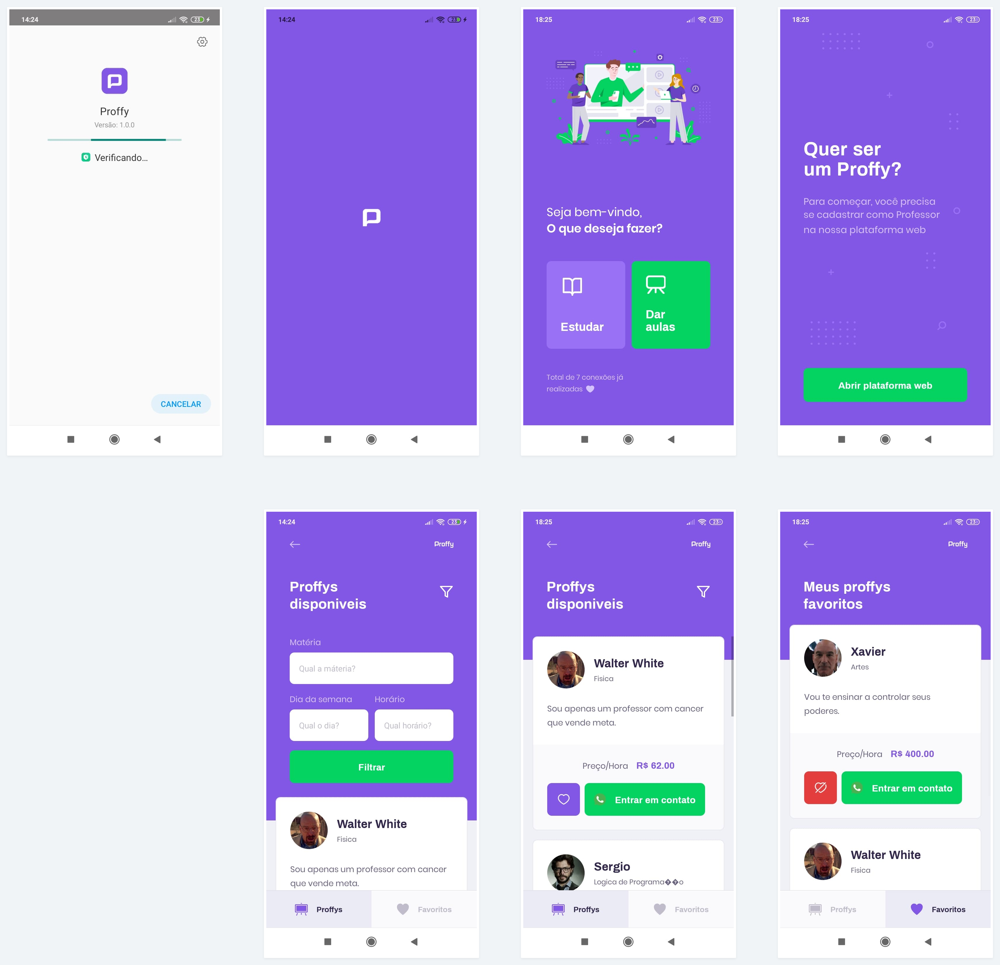

<h1 align="center">
  
</h1>

<p align="center" id="description">
  Projeto proposto pela https://rocketseat.com.br/ durante a Next Level Week #2 que ocorreu entre 03/08/2020 e 09/08/2020.
</p>

<h2 id="features">
  Features
</h2>

### Mobile

- [x] Opção de estudar.
- [x] Fitragem de professores.
- [x] Entrar em contado com os professores pelo Whatsapp.


<h2 id="tecnologias">
  Tecnologias
</h2>

 As seguintes ferramentas foram usadas na construção do projeto:

- [Expo](https://expo.io/)
- [Node.js](https://nodejs.org/en/)
- [React](https://pt-br.reactjs.org/)
- [React Native](https://reactnative.dev/)
- [TypeScript](https://www.typescriptlang.org/)
- [StyledComponents](https://styled-components.com/)

<h2 id="install">
   Instalação
</h2>

### Rodando a versão web

```bash

# Instale as dependências
$ yarn

# Execute aplicação
yarn start

# Será aberto uma janela com o metro budler da Expo, basta baixar o Expo Client na sua AppStore e escanear o QR-Code
```

<h2 id="author">
   Autor
</h2>

<a href="https://github.com/luishjacinto/">
 
 <br />
 <sub><b>Luis Henrique Jacinto</b></sub>
</a>


<h2 id="author">
   Baixe o aplicativo
</h2>

<a align="center" href="https://github.com/luishjacinto/">
  
</a>
